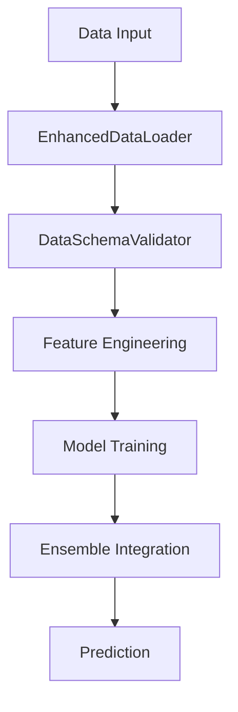

# Next Random Number Identifier - Architecture Documentation

## System Overview

The Next Random Number Identifier (NRNI) is a machine learning-based system designed to analyze and forecast random number sequences using multiple analytical approaches combined in an ensemble architecture. The system integrates statistical analysis, feature engineering, and machine learning to identify patterns in seemingly random data.

## Core Components

### 1. Data Processing Layer


The Data Processing Layer is responsible for loading, validating, preprocessing, and enriching raw data:

- **EnhancedDataLoader**: Provides robust data loading with comprehensive error handling, validation, and preprocessing
- **DataSchemaValidator**: Validates data schema, structure, and content integrity
- **Data Monitoring**: Tracks data quality metrics and detects drift in data characteristics

### 2. Feature Engineering Layer


The Feature Engineering Layer transforms raw data into meaningful features for model training:

- **FeatureEngineer**: Creates time-based, statistical, lag, and pattern features
- **FeatureSelector**: Identifies and selects the most relevant features for modeling
- **Feature Groups**: Organizes features into logical categories (time, rolling, lag, frequency, etc.)

### 3. Model Layer


The Model Layer contains all predictive models and their integration:

- **Base Model Interface**: Common interface for all models defining fit, predict, and evaluate methods
- **Individual Models**:
  - **RandomForestModel**: Captures non-linear relationships between features
  - **XGBoostModel**: Classification approach for number prediction
  - **MarkovChain**: Probabilistic transition-based predictor
  - **HybridForecaster**: Combines statistical (ARIMA) and machine learning approaches
- **Ensemble Models**:
  - **EnhancedEnsemble**: Combines multiple models with flexible weighting strategies
  - **AdaptiveEnsemble**: Dynamically adjusts model weights based on recent performance

### 4. Evaluation and Monitoring Layer


The Evaluation and Monitoring Layer tracks model performance and detects drift:

- **ModelEvaluator**: Calculates comprehensive performance metrics for models
- **ModelPerformanceTracker**: Tracks model performance over time
- **ModelMonitor**: Detects model drift and triggers alerts
- **ValidationFramework**: Validates model predictions and expectations

### 5. User Interface Layer


The User Interface Layer provides interaction points for users:

- **Command-Line Interface**: Main interaction method for users
- **Configuration System**: Allows customization of system behavior
- **Visualization Tools**: Graphical representation of model results
- **Reporting System**: Generates reports of model performance and predictions

## Data Flow

1. **Data Ingestion**: The `EnhancedDataLoader` loads data from CSV files, handling errors, missing values, and standardizing column names.

2. **Data Preprocessing**: The loader validates and cleans the data, ensuring proper date formats and numerical values.

3. **Feature Engineering**: The `FeatureEngineer` transforms raw data into meaningful features, creating time-based, statistical, lag, frequency, and pattern features.

4. **Feature Selection**: The `FeatureSelector` identifies the most important features using multiple selection methods.

5. **Model Training**: Individual models (RandomForest, XGBoost, MarkovChain) are trained on the engineered features.

6. **Ensemble Integration**: The `EnhancedEnsemble` combines individual model predictions using weighted averaging, confidence-weighted, or variance-weighted approaches.

7. **Prediction Generation**: The ensemble produces final predictions with confidence estimates.

8. **Performance Monitoring**: The `ModelPerformanceTracker` and `ModelMonitor` track performance and detect drift over time.

9. **Reporting & Visualization**: Results are presented to the user through the CLI and visualization tools.

## Key Interfaces

### EnhancedDataLoader Interface

```python
def load_csv(filename: str, **kwargs) -> pd.DataFrame:
    """Load CSV data from the data directory."""

def preprocess_data(df: pd.DataFrame) -> pd.DataFrame:
    """Preprocess the data for analysis."""

def validate_data(df: pd.DataFrame) -> Dict[str, Any]:
    """Run comprehensive validation on a DataFrame."""

def get_data_profile(df: pd.DataFrame) -> Dict[str, Any]:
    """Generate a comprehensive data profile for exploratory analysis."""
```

### BaseModel Interface

```python
@abstractmethod
def fit(self, X: pd.DataFrame, y: pd.Series) -> 'BaseModel':
    """Fit the model to the training data."""

@abstractmethod
def predict(self, X: pd.DataFrame) -> np.ndarray:
    """Make predictions using the fitted model."""

@abstractmethod
def get_feature_importance(self) -> Dict[str, float]:
    """Get feature importance scores."""

@abstractmethod
def estimate_confidence(self, X: pd.DataFrame) -> np.ndarray:
    """Estimate prediction confidence."""
```

### EnhancedEnsemble Interface

```python
def fit(self, X: pd.DataFrame, y: pd.Series) -> 'EnhancedEnsemble':
    """Fit all models in the ensemble and initialize performance tracking."""

def predict(self, X: pd.DataFrame) -> np.ndarray:
    """Generate ensemble predictions using the selected combination method."""

def update_weights(self, performance_metrics: Dict[str, Dict[str, float]]) -> None:
    """Update model weights based on recent performance."""

def get_performance_summary(self) -> Dict[str, Dict[str, Any]]:
    """Get a summary of model performance and ensemble metrics."""
```

## Deployment Considerations

### Environment Requirements

- Python 3.8+
- Required packages: pandas, numpy, scikit-learn, xgboost, matplotlib, statsmodels
- Recommended: 4+ CPU cores for parallel feature engineering
- Memory: Minimum 4GB RAM, 8GB+ recommended for larger datasets

### Scalability

- Data volume: The system is designed to handle datasets with up to 10,000 records efficiently
- Feature generation is the most memory-intensive operation
- Model training can be parallelized for larger datasets
- Ensemble prediction is optimized for low-latency results

### Monitoring

- Model drift detection through the `ModelMonitor`
- Performance tracking via the `ModelPerformanceTracker`
- Data quality monitoring in the `EnhancedDataLoader`
- CLI reporting of model performance metrics

## Development Workflow

1. Data loading and validation through `EnhancedDataLoader`
2. Feature engineering using `FeatureEngineer`
3. Feature selection with `FeatureSelector`
4. Model training via the model implementations
5. Ensemble configuration and training
6. Performance evaluation and monitoring
7. Prediction generation and visualization

## Extension Points

The system is designed with several extension points:

1. **Additional Models**: New models can be added by implementing the `BaseModel` interface
2. **Feature Engineering**: New feature types can be added to the `FeatureEngineer`
3. **Ensemble Methods**: Additional combination strategies can be implemented in `EnhancedEnsemble`
4. **Data Sources**: The `EnhancedDataLoader` can be extended to support additional file formats
5. **Visualization**: New visualization types can be added to the visualization module

## Interactive Diagrams

The architecture diagrams in this documentation are available in Mermaid format for interactive viewing and modification:

- Diagrams are stored in both `.mermaid` and `.png` formats in the `docs/diagrams/` directory
- For interactive viewing and editing:
  - **GitHub Rendering**: GitHub now supports Mermaid diagrams directly in markdown files
  - **Mermaid Live Editor**: Use [Mermaid Live Editor](https://mermaid.live/) for interactive viewing and editing
  - **VS Code Extensions**: Consider using Mermaid preview extensions in VS Code for local development

To embed a Mermaid diagram directly in GitHub markdown:



This approach allows for:
- Interactive exploration of diagrams
- Easy updates when architecture changes
- Better collaboration through version-controlled diagram code
- Consistency between documentation and visual representations
